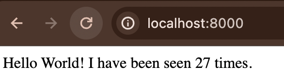

#Observações desafio 4 - Docker Compose 

1. No arquivo Dockerfile    
Comentar a linha de código  
`RUN apk add --no-cache gcc musl-dev linux-headers`
 2. No arquivo docker-compose.yml   
- version: versão do compose -> version já é um comando obsoleto, atualmente o docker compose já identifica a versão automaticamente  
- serviço 'web' -> serviço que vai rodar a aplicação 'app.py'
- image: desafio4 -> imagem da aplicação
- networks: desafio4compose -> criação da network das aplicações 
- image: redis:latest -> tem que dar `podman pull redis` para fazer o build dessa imagem do redis
- networks: rede


## Comandos utilizados  
- `podman build -t desafio4` 
- `podman pull redis`
- `podman compose up -d`
- `podman ps`
- `curl localhost:8000`
- `podman compose down`

### Saída  

  

`curl localhost:8000`  
```
Hello World! I have been seen 26 times.
```

`podman compose down`  

```
curl: (7) Failed to connect to localhost port 8000 after 0 ms: Couldn't connect to server
```
`podman compose up -d`



O volume persistiu, iniciou a partir da contagem 26 e não reiniciou a partir da 1.

